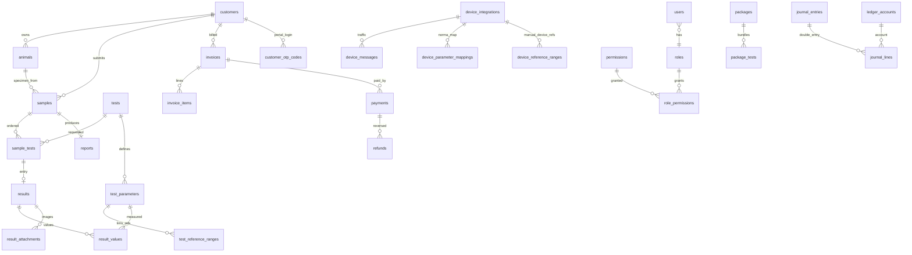

# Database Documentation — Rare Vet LIMS

> **Generated:** 2026-07-03  
> **Engine:** PostgreSQL 16+  
> **Companion docs:** `PROJECT_INVENTORY.md`, `DEPENDENCY_MAP.md`, `DEAD_CODE_REPORT.md`, `backend/API.md`

---

## 1. Overview

| Item | Value |
|------|-------|
| Database | PostgreSQL |
| Driver | `pg` connection pool (`backend/src/config/database.js`) |
| Connection | `DATABASE_URL` **or** `PGHOST` / `PGPORT` / `PGUSER` / `PGPASSWORD` / `PGDATABASE` |
| SSL | Enabled in production (`rejectUnauthorized: false`) |
| Pool size | max 20 connections |
| UUIDs | Generated in **application code** (`uuid` npm package); DB defaults use `uuid_generate_v4()` in `init.sql` |
| Extensions | `pgcrypto` (enabled in `init.sql`; `uuid-ossp` intentionally **not** used — blocked on some Windows hosts) |
| Schema bootstrap | `backend/migrations/init.sql` — first run only |
| Incremental patches | `backend/src/scripts/migrate.js` — runs on every deploy via `cloud-start.js` |
| Seed data | `backend/src/scripts/seed.js` — optional (`RUN_SEED=true`) |

### Migration flow

```
npm run migrate  OR  cloud-start.js
        │
        ├─ roles table missing? → execute init.sql (full schema)
        └─ applyPatches()       → ALTER / CREATE IF NOT EXISTS / seed mappings / permissions sync
```

**Important:** There is no numbered migration file chain. The **effective schema** = `init.sql` + all patches in `migrate.js`. This document describes the **effective** schema as of 2026-07-03.

---

## 2. Domain map



---

## 3. PostgreSQL ENUM types

| Type | Values | Used by |
|------|--------|---------|
| `animal_type` | `camel`, `sheep`, `horse`, `goat`, `other` | `animals.animal_type`, `test_reference_ranges.animal_type` |
| `animal_gender` | `male`, `female`, `unknown` | `animals.gender` |
| `sample_status` | `pending`, `received`, `running`, `completed`, `rejected`, `archived` | `samples.status`, `sample_tests.status` |
| `payment_method` | `cash`, `card`, `bank_transfer`, `credit` | `payments.method` |
| `invoice_status` | `draft`, `issued`, `paid`, `partial`, `cancelled`, `refunded`, `partial_refunded`* | `invoices.status` |
| `inventory_category` | `reagent`, `tube`, `slide`, `consumable`, `chemical`, `other` | `inventory_items.category` |

\* `partial_refunded` added by `migrate.js` patch (PostgreSQL `ADD VALUE`).

**Legacy note:** Pre-migration records may still contain enum values `bird`, `cat`, `dog` in older databases until `migrate.js` runs (`UPDATE animals SET animal_type = 'other' WHERE …`).

---

## 4. Tables by domain

### 4.1 Auth & RBAC

#### `roles`

| Column | Type | Notes |
|--------|------|-------|
| `id` | SERIAL PK | |
| `name` | VARCHAR(50) UNIQUE | e.g. `admin`, `manager`, `reception`, `lab_technician`, `lab_specialist`, `veterinarian`, `accountant` |
| `name_ar` | VARCHAR(100) | |
| `description` | TEXT | |
| `created_at` | TIMESTAMPTZ | |

#### `permissions`

| Column | Type | Notes |
|--------|------|-------|
| `id` | SERIAL PK | |
| `code` | VARCHAR(100) UNIQUE | e.g. `reports.generate`, `reference_ranges.manage` |
| `module` | VARCHAR(50) | First segment of code |
| `description` | TEXT | |
| `created_at` | TIMESTAMPTZ | |

Catalog synced from `backend/src/utils/permissions.js` on every migrate.

#### `role_permissions`

| Column | Type | Notes |
|--------|------|-------|
| `role_id` | INTEGER FK → `roles` | CASCADE delete |
| `permission_id` | INTEGER FK → `permissions` | CASCADE delete |
| **PK** | `(role_id, permission_id)` | |

#### `users`

| Column | Type | Notes |
|--------|------|-------|
| `id` | UUID PK | |
| `username` | VARCHAR(50) UNIQUE | Backfilled by migrate if missing; index `idx_users_username_lower` |
| `email` | VARCHAR(255) UNIQUE | |
| `password_hash` | VARCHAR(255) | bcrypt |
| `full_name`, `full_name_ar` | VARCHAR(255) | |
| `phone` | VARCHAR(50) | |
| `role_id` | INTEGER FK → `roles` | |
| `language` | VARCHAR(5) | default `en` |
| `theme` | VARCHAR(10) | default `light` |
| `is_active` | BOOLEAN | |
| `last_login` | TIMESTAMPTZ | |
| `password_reset_token`, `password_reset_expires` | | |
| `created_at`, `updated_at` | TIMESTAMPTZ | `updated_at` set in app code (no DB triggers) |

#### `refresh_tokens`

| Column | Type | Notes |
|--------|------|-------|
| `id` | UUID PK | |
| `user_id` | UUID FK → `users` | CASCADE |
| `token_hash` | VARCHAR(255) | |
| `expires_at` | TIMESTAMPTZ | |
| `created_at` | TIMESTAMPTZ | |

---

### 4.2 Customers & animals

#### `customers`

| Column | Type | Notes |
|--------|------|-------|
| `id` | UUID PK | |
| `full_name`, `full_name_ar` | VARCHAR(255) | |
| `mobile` | VARCHAR(50) NOT NULL | indexed |
| `city`, `farm_company`, `notes` | | |
| `account_balance`, `credit_limit` | DECIMAL(12,2) | |
| `is_active` | BOOLEAN | |
| `created_by` | UUID FK → `users` | |
| `created_at`, `updated_at` | TIMESTAMPTZ | |

**Indexes:** `idx_customers_mobile`, `idx_customers_name`

#### `animals`

| Column | Type | Notes |
|--------|------|-------|
| `id` | UUID PK | |
| `animal_code` | VARCHAR(50) UNIQUE | indexed |
| `animal_type` | `animal_type` | |
| `name_tag`, `age`, `gender`, `weight`, `color` | | |
| `breed` | VARCHAR(100) | added by migrate |
| `rfid_chip` | VARCHAR(100) | indexed |
| `owner_id` | UUID FK → `customers` | SET NULL on delete |
| `image_url`, `medical_history` | | |
| `is_active` | BOOLEAN | |
| `created_by` | UUID FK → `users` | |
| `created_at`, `updated_at` | TIMESTAMPTZ | |

**Indexes:** `idx_animals_owner`, `idx_animals_code`, `idx_animals_rfid`

#### `customer_otp_codes` *(migrate patch)*

Portal SMS/email OTP login.

| Column | Type | Notes |
|--------|------|-------|
| `id` | UUID PK | |
| `customer_id` | UUID FK → `customers` | CASCADE |
| `otp_hash` | VARCHAR(64) | SHA-256 hash |
| `attempts` | INTEGER | default 0 |
| `expires_at` | TIMESTAMPTZ | |
| `used_at` | TIMESTAMPTZ | |
| `created_at` | TIMESTAMPTZ | |

**Index:** `idx_customer_otp_customer (customer_id, created_at DESC)`

---

### 4.3 Test catalog

#### `test_categories`

| Column | Type | Notes |
|--------|------|-------|
| `id` | SERIAL PK | |
| `code` | VARCHAR(20) UNIQUE | e.g. `CBC`, `CHEM`, `MICRO` |
| `name`, `name_ar` | VARCHAR(100) | |
| `department` | VARCHAR(100) | |
| `sort_order` | INTEGER | |
| `is_active` | BOOLEAN | `PARAS` category deactivated by migrate |

#### `tests`

| Column | Type | Notes |
|--------|------|-------|
| `id` | UUID PK | |
| `code` | VARCHAR(50) UNIQUE | e.g. `CBC-FULL` |
| `name`, `name_ar` | VARCHAR(255) | |
| `category_id` | INTEGER FK → `test_categories` | |
| `description` | TEXT | |
| `price` | DECIMAL(10,2) | |
| `turnaround_hours` | INTEGER | default 24 |
| `unit`, `method` | VARCHAR | |
| `label_copies` | INTEGER NOT NULL | default 1 — Zebra label count |
| `is_active` | BOOLEAN | |
| `requires_specimen` | VARCHAR(100) | |
| `created_at`, `updated_at` | TIMESTAMPTZ | |

#### `test_parameters`

| Column | Type | Notes |
|--------|------|-------|
| `id` | UUID PK | |
| `test_id` | UUID FK → `tests` | CASCADE |
| `code` | VARCHAR(50) | e.g. `WBC`, `HGB` — Norma OBX maps here |
| `name`, `name_ar` | VARCHAR(255) | |
| `unit` | VARCHAR(50) | |
| `sort_order` | INTEGER | |
| `is_calculated` | BOOLEAN | |
| `formula` | TEXT | |
| `decimal_places` | INTEGER | default 2 |
| `is_active` | BOOLEAN | |

#### `test_reference_ranges` — **LIMS source of truth for report refs**

Base (`init.sql`) + patches (`migrate.js`):

| Column | Type | Notes |
|--------|------|-------|
| `id` | UUID PK | |
| `parameter_id` | UUID FK → `test_parameters` | CASCADE |
| `animal_type` | `animal_type` | species-specific |
| `min_value`, `max_value` | DECIMAL(12,4) | numeric bounds |
| `critical_low`, `critical_high` | DECIMAL(12,4) | |
| `unit` | VARCHAR(50) | |
| `notes` | TEXT | Manual notes win over `Norma:` / `Synced from` auto rows |
| `sex` | VARCHAR(20) | patch — future demographic refs |
| `age_min`, `age_max` | INTEGER | patch |
| `age_unit` | VARCHAR(20) | patch |
| `device_id` | UUID FK → `device_integrations` | patch — optional link |
| `text_reference` | TEXT | patch — non-numeric ref display |
| `is_active` | BOOLEAN | default true |
| `created_by`, `updated_by` | UUID FK → `users` | |
| `created_at`, `updated_at` | TIMESTAMPTZ | |

**Unique index:** `uq_test_reference_ranges_param_species (parameter_id, animal_type)` — duplicates cleaned on migrate.

**Priority at read time** (`reference-ranges.service.js`):

1. Manual notes (not `Norma:` / `Synced from`)
2. Empty notes
3. Auto-synced notes

**Writers:** `Tests.jsx` CRUD, `ReferenceRanges.jsx` admin, `sync-norma-references.js` boot script (static Norma tables → LIMS).

#### `packages` / `package_tests`

Marketing bundles. `package_tests` PK `(package_id, test_id)`.

---

### 4.4 Sample workflow

#### `samples`

| Column | Type | Notes |
|--------|------|-------|
| `id` | UUID PK | |
| `sample_code` | VARCHAR(50) UNIQUE | human ID |
| `barcode` | VARCHAR(100) UNIQUE | Code128 — Norma PID target |
| `customer_id` | UUID FK → `customers` | |
| `animal_id` | UUID FK → `animals` | |
| `status` | `sample_status` | workflow state |
| `department`, `priority`, `notes`, `rejection_reason` | | |
| `collection_date`, `received_date`, `completed_date` | TIMESTAMPTZ | |
| `assigned_technician`, `created_by` | UUID FK → `users` | |
| `created_at`, `updated_at` | TIMESTAMPTZ | |

**Indexes:** `idx_samples_status`, `idx_samples_barcode`, `idx_samples_customer`

#### `sample_tests`

| Column | Type | Notes |
|--------|------|-------|
| `id` | UUID PK | |
| `sample_id` | UUID FK → `samples` | CASCADE |
| `test_id` | UUID FK → `tests` | |
| `status` | `sample_status` | per-test progress |
| `price` | DECIMAL(10,2) | snapshot at order time |
| `started_at`, `completed_at` | TIMESTAMPTZ | |
| `technician_id` | UUID FK → `users` | |
| `notes` | TEXT | |
| **UNIQUE** | `(sample_id, test_id)` | |

---

### 4.5 Results

#### `results`

One result header per `sample_test` (validated result set).

| Column | Type | Notes |
|--------|------|-------|
| `id` | UUID PK | |
| `sample_test_id` | UUID FK → `sample_tests` | CASCADE — **not** `sample_id` |
| `entered_by`, `validated_by` | UUID FK → `users` | |
| `validated_at` | TIMESTAMPTZ | |
| `is_validated` | BOOLEAN | gate for reports |
| `doctor_notes`, `technician_notes` | TEXT | |
| `has_critical` | BOOLEAN | |
| `created_at`, `updated_at` | TIMESTAMPTZ | |

#### `result_values`

| Column | Type | Notes |
|--------|------|-------|
| `id` | UUID PK | |
| `result_id` | UUID FK → `results` | CASCADE |
| `parameter_id` | UUID FK → `test_parameters` | |
| `value` | VARCHAR(255) | display / qualitative |
| `numeric_value` | DECIMAL(12,4) | for flags & trends |
| `flag` | VARCHAR(20) | `NORMAL`, `HIGH`, `LOW`, `CRIT_*`, `POS`, `NEG` |
| `is_critical` | BOOLEAN | |
| `notes` | TEXT | May contain historical `Norma: x-y` snapshot from device import |

#### `result_attachments` *(migrate patch)*

Microscopy / parasitology images.

| Column | Type | Notes |
|--------|------|-------|
| `id` | UUID PK | |
| `result_id` | UUID FK → `results` | CASCADE |
| `parameter_id` | UUID FK → `test_parameters` | optional link |
| `file_url` | TEXT NOT NULL | local path or S3 key |
| `caption` | TEXT | |
| `sort_order` | INTEGER | |
| `include_in_report` | BOOLEAN | default true — patch |
| `uploaded_by` | UUID FK → `users` | |
| `created_at` | TIMESTAMPTZ | |

**Index:** `idx_result_attachments_result`

---

### 4.6 Reports

#### `reports`

| Column | Type | Notes |
|--------|------|-------|
| `id` | UUID PK | |
| `report_number` | VARCHAR(50) UNIQUE | e.g. `RPT-2026-0042` |
| `sample_id` | UUID FK → `samples` | one report per sample |
| `pdf_url` | TEXT | stored PDF path/URL |
| `qr_verification_code` | VARCHAR(100) UNIQUE | public verify link |
| `generated_by` | UUID FK → `users` | |
| `specialist_signature` | TEXT | legacy field |
| `lab_specialist_approved_by`, `lab_specialist_approved_at` | | patch |
| `vet_approved_by`, `vet_approved_at` | | patch |
| `language` | VARCHAR(5) | `ar` / `en` |
| `ai_interpretation` | TEXT | stored text; generator service not wired |
| `treatment_recommendations` | TEXT | manual / API on generate |
| `is_final` | BOOLEAN | |
| `created_at` | TIMESTAMPTZ | |

**Read path for result rows:** `sample_tests` → `results` → `result_values` → LIMS ref lateral join (`limsRefLateralJoin`).

---

### 4.7 Billing & accounting

#### `invoices`

| Column | Type | Notes |
|--------|------|-------|
| `id` | UUID PK | |
| `invoice_number` | VARCHAR(50) UNIQUE | |
| `customer_id`, `sample_id` | UUID FK | |
| `subtotal`, `discount_amount`, `discount_percent`* | DECIMAL | *percent patch |
| `tax_rate`, `tax_amount`, `total` | DECIMAL | default VAT 15% |
| `status` | `invoice_status` | |
| `vat_qr_data` | TEXT | ZATCA QR payload |
| `pdf_url` | TEXT | patch — regenerated when lab contact changes |
| `notes` | TEXT | |
| `created_by` | UUID FK → `users` | |
| `created_at`, `updated_at` | TIMESTAMPTZ | |

#### `invoice_items`

Line items; `animal_id` UUID FK added by migrate.

#### `payments` / `refunds`

Standard payment tracking linked to invoices and customers.

#### `price_quotes` / `price_quote_items` *(migrate patch)*

Pre-sale quotes with PDF cache (`pdf_url`).

#### `ledger_accounts` / `journal_entries` / `journal_lines` *(migrate patch)*

Double-entry accounting skeleton.

| Table | Purpose |
|-------|---------|
| `ledger_accounts` | Chart of accounts (`code`, `type`) |
| `journal_entries` | Header (`source_type`, `source_id`) |
| `journal_lines` | Debit/credit lines |

#### `daily_closings` *(migrate patch)*

End-of-day cash register close with `totals JSONB`, `pdf_url`.

#### `accounting_reports` *(migrate patch)*

Generated accounting export metadata.

---

### 4.8 Inventory & quality

| Table | Purpose |
|-------|---------|
| `inventory_items` | SKU stock with lot/expiry |
| `inventory_transactions` | in/out/adjust movements |
| `qc_records` | QC run results |
| `device_maintenance` | maintenance log |
| `calibration_logs` | device calibration |
| `temperature_logs` | fridge/environment monitoring |

---

### 4.9 Devices & Norma integration

#### `device_integrations`

| Column | Type | Notes |
|--------|------|-------|
| `id` | UUID PK | |
| `name`, `model` | VARCHAR | e.g. `Norma CBC` |
| `protocol` | VARCHAR(50) | HL7, ASTM, etc. |
| `connection_type`, `host`, `port`, `serial_port` | | |
| `config` | JSONB | **`api_key`** stored here for bridge auth |
| `is_active` | BOOLEAN | |
| `last_connected` | TIMESTAMPTZ | |
| `created_at` | TIMESTAMPTZ | |

#### `device_messages`

Raw and parsed device traffic.

| Column | Type | Notes |
|--------|------|-------|
| `id` | UUID PK | |
| `device_id` | UUID FK → `device_integrations` | |
| `direction` | VARCHAR(10) | in/out |
| `raw_message` | TEXT | HL7/ASTM payload |
| `parsed_data` | JSONB | normalized results + refs from message |
| `sample_id` | UUID FK → `samples` | linked after barcode match |
| `status` | VARCHAR(20) | |
| `created_at` | TIMESTAMPTZ | |

Used by Norma ingest, ref debug UI, and `pull-norma-species-refs.js`.

#### `device_parameter_mappings` *(migrate patch)*

Maps device OBX codes → `test_parameters.id`.

| Column | Type | Notes |
|--------|------|-------|
| `device_name` | VARCHAR(255) | default `Norma CBC` |
| `device_parameter_code` | VARCHAR(80) | Norma code |
| `system_parameter_id` | UUID FK → `test_parameters` | CASCADE |
| `display_name_ar`, `display_name_en`, `unit`, `value_type` | | |
| `is_active` | BOOLEAN | |
| **Unique** | `(device_name, UPPER(device_parameter_code))` WHERE active | |

Seeded on migrate via `seedNormaCbcMappings()`.

#### `device_reference_ranges` *(migrate patch)*

**Manual admin only** — Norma auto-sync disabled (see `DEAD_CODE_REPORT.md`).

| Column | Type | Notes |
|--------|------|-------|
| `device_name`, `parameter_code`, `species`, `unit` | | composite unique |
| `low_value`, `high_value` | DECIMAL(14,4) | nullable after patch |
| `reference_text` | TEXT | text-only refs |
| `source` | VARCHAR(50) | default `device` |
| `last_synced_at`, `created_at`, `updated_at` | TIMESTAMPTZ | |

**Not used** in report PDF reference display (reports use `test_reference_ranges` only).

#### `device_reference_range_logs`

Audit trail for device ref changes (`change_reason`, optional `message_id` FK).

#### `reference_range_audit_logs` *(migrate patch)*

LIMS ref admin audit (`reference_ranges-admin.service.js`):

| Column | Type |
|--------|------|
| `reference_range_id` | UUID (nullable if deleted) |
| `user_id` | FK → `users` |
| `action` | VARCHAR(50) |
| `old_value`, `new_value` | JSONB |
| `created_at` | TIMESTAMPTZ |

---

### 4.10 System

#### `settings`

| Column | Type | Notes |
|--------|------|-------|
| `key` | VARCHAR(100) PK | |
| `value` | JSONB | |
| `updated_by` | UUID FK → `users` | |
| `updated_at` | TIMESTAMPTZ | |

**Known keys:**

| Key | Content |
|-----|---------|
| `lab_info` | Lab name, phone, email, VAT — seeded; updated by `syncLabContactInfo` on migrate |
| `invoice_template` | Invoice PDF layout + nested `lab` contact block |

#### `audit_logs`

Application audit trail (user actions across modules).

#### `notification_queue`

Outbound SMS/email queue (`channel`, `recipient`, `body`, `metadata JSONB`, `status`).

---

## 5. Indexes summary

| Index | Table | Columns |
|-------|-------|---------|
| `idx_customers_mobile` | customers | mobile |
| `idx_customers_name` | customers | full_name |
| `idx_animals_owner` | animals | owner_id |
| `idx_animals_code` | animals | animal_code |
| `idx_animals_rfid` | animals | rfid_chip |
| `idx_samples_status` | samples | status |
| `idx_samples_barcode` | samples | barcode |
| `idx_samples_customer` | samples | customer_id |
| `idx_users_username_lower` | users | LOWER(username) UNIQUE |
| `idx_audit_*` | audit_logs | user_id, module, created_at |
| `idx_result_attachments_result` | result_attachments | result_id |
| `idx_customer_otp_customer` | customer_otp_codes | customer_id, created_at DESC |
| `idx_journal_entries_date` | journal_entries | entry_date DESC |
| `idx_price_quotes_created` | price_quotes | created_at DESC |
| `idx_device_ref_ranges_unique` | device_reference_ranges | device_name, parameter_code, species, COALESCE(unit,'') |
| `idx_device_ref_ranges_species` | device_reference_ranges | species, parameter_code |
| `idx_device_ref_logs_created` | device_reference_range_logs | created_at DESC |
| `uq_test_reference_ranges_param_species` | test_reference_ranges | parameter_id, animal_type UNIQUE |
| `idx_dpm_device_code` | device_parameter_mappings | device_name, UPPER(device_parameter_code) WHERE is_active |
| `idx_ref_range_audit_created` | reference_range_audit_logs | created_at DESC |
| `idx_daily_closings_date` | daily_closings | closing_date DESC |

---

## 6. Core data flows

### 6.1 Sample → result → report

```
customers + animals
    → samples (barcode)
    → sample_tests (ordered tests)
    → results + result_values (technician / device import)
    → reports (PDF + preview DTO)
```

Reports require `results.is_validated = true`.

### 6.2 Reference ranges (current policy)

| Layer | Table | Report flags | Auto-sync |
|-------|-------|--------------|-----------|
| **LIMS manual** | `test_reference_ranges` | **Yes** | `sync-norma-references.js` seeds static Norma tables into LIMS |
| **Device table** | `device_reference_ranges` | **No** | Disabled — manual CRUD in UI only |
| **Result snapshot** | `result_values.notes` | Historical debug only | Written on Norma import (`Norma: …`) |

SQL join used in reports:

```sql
LEFT JOIN LATERAL (
  SELECT min_value, max_value, critical_low, critical_high, notes, text_reference
  FROM test_reference_ranges trr
  WHERE trr.parameter_id = tp.id
    AND trr.animal_type = a.animal_type
    AND (trr.is_active IS NULL OR trr.is_active = true)
  ORDER BY /* manual > empty > Norma/synced */ ...
  LIMIT 1
) trr ON true
```

### 6.3 Norma device import

```
bridge/norma-listener.js
    → POST /devices/messages (api_key in device_integrations.config)
    → device_messages (raw + parsed_data JSONB)
    → device-import.service
        → device_parameter_mappings (code map)
        → results / result_values upsert
        → (no device_reference_ranges sync)
```

### 6.4 Portal access

```
customers.mobile
    → customer_otp_codes (hashed OTP)
    → JWT session
    → reports WHERE sample.customer_id = customer.id
```

---

## 7. Boot scripts touching the database

Run sequentially from `cloud-start.js` after HTTP starts:

| Script | DB effect |
|--------|-----------|
| `migrate.js` | Schema patches, permissions, Norma mapping seed, ref dedup |
| `sync-lab-contact.js` | Updates `settings` contact + clears invoice/quote PDF cache |
| `sync-cbc-params.js` | Ensures CBC parameters exist |
| `sync-norma-references.js` | Upserts **LIMS** `test_reference_ranges` from static tables |
| `ensure-result-attachments.js` | Table guard |
| `ensure-parasitology.js` | Paras test catalog |
| `sync-device-reference-ranges.js` | **No-op stub** (disabled) |
| `ensure-admin.js` | Admin user |
| `seed.js` | Only if `RUN_SEED=true` |

**Manual maintenance scripts:** `clear-device-reference-ranges.js`, `backup-db.js`, `backup-db-pg.js`, audit scripts under `backend/src/scripts/`.

---

## 8. Service → table map

| Service | Primary tables |
|---------|----------------|
| `users.service` | users, refresh_tokens, roles |
| `customers.service` | customers |
| `animals.service` | animals, samples, result_values, test_reference_ranges |
| `samples.service` | samples, sample_tests |
| `tests.service` | tests, test_parameters, test_reference_ranges, packages |
| `results.service` | results, result_values, result_attachments, samples |
| `reports.service` | reports, samples, sample_tests, results, result_values, result_attachments |
| `reference-ranges.service` | test_reference_ranges, device_messages |
| `reference-ranges-admin.service` | test_reference_ranges, reference_range_audit_logs |
| `device-reference-ranges.service` | device_reference_ranges, device_reference_range_logs |
| `device-parameter-mappings.service` | device_parameter_mappings |
| `devices.service` | device_integrations, device_messages |
| `device-import.service` | device_messages, results, result_values |
| `portal.service` | customers, customer_otp_codes, reports, invoices |
| `billing.service` | invoices, invoice_items, payments, refunds |
| `inventory.service` | inventory_items, inventory_transactions |
| `quality.service` | qc_records, device_maintenance, calibration_logs, temperature_logs |
| `dashboard.service` | samples, payments, invoices, sample_tests, results |

---

## 9. Known schema / query issues

| Issue | Detail | Impact |
|-------|--------|--------|
| **`uuid_generate_v4()` in init.sql** | Extension `uuid-ossp` commented out; fresh `init.sql` run may fail on DEFAULT unless function exists | Mitigated: app passes explicit UUIDs on INSERT; production DBs already exist |
| **`portal.service.js` uses `res.sample_id`** | `results` has `sample_test_id`, not `sample_id` | Portal attachment documents query may fail silently (caught in try/catch) — fix: join via `sample_tests` |
| **`reports.lab_specialist_license`** | Selected in some report queries but **no column** on `users` | Falls back to `env.lab.licenseNumber` |
| **Dual ref admin** | `Tests.jsx` and `ReferenceRanges.jsx` both write `test_reference_ranges` | By design; same table, different UX |
| **`device_reference_ranges` orphaned read path** | Exported SQL helpers never used in reports | Table kept for manual device ref archive |

---

## 10. Backup & environment

| Variable | Purpose |
|----------|---------|
| `DATABASE_URL` | Primary connection string (Render) |
| `PGHOST`, `PGPORT`, `PGUSER`, `PGPASSWORD`, `PGDATABASE` | Local fallback |
| `RUN_SEED` | `true` → run seed on cloud boot |
| `LAB_PHONE`, `VAT_NUMBER`, `LAB_EMAIL` | Written into `settings` on migrate |

Backup scripts: `npm run backup` → `backend/src/scripts/backup-db.js` (and `backup-db-pg.js` for native pg_dump).

---

## 11. Table inventory (quick reference)

**init.sql (35 tables/types):**  
roles, permissions, role_permissions, users, refresh_tokens, customers, animals, test_categories, tests, test_parameters, test_reference_ranges, samples, sample_tests, results, result_values, reports, packages, package_tests, invoices, invoice_items, payments, refunds, inventory_items, inventory_transactions, qc_records, device_maintenance, calibration_logs, temperature_logs, notification_queue, device_integrations, device_messages, settings, audit_logs

**migrate.js additions (11 tables):**  
result_attachments, customer_otp_codes, ledger_accounts, journal_entries, journal_lines, daily_closings, accounting_reports, price_quotes, price_quote_items, device_reference_ranges, device_reference_range_logs, device_parameter_mappings, reference_range_audit_logs

**Effective total: 48 tables** (+ 6 ENUM types)

---

*End of DATABASE_DOCUMENTATION — reflects `init.sql` + `migrate.js` as of 2026-07-03. Re-verify after schema patches.*
