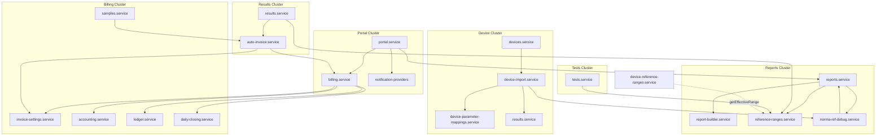

# DEPENDENCY_MAP.md

**المشروع:** Rare Vet LIMS  
**الغرض:** خريطة الاعتماديات بين الوحدات — من API إلى DB إلى UI إلى الأجهزة  
**مرتبط بـ:** [`PROJECT_INVENTORY.md`](PROJECT_INVENTORY.md) · [`LIMS_ENTERPRISE_V2_ARCHITECTURE.md`](LIMS_ENTERPRISE_V2_ARCHITECTURE.md)  
**آخر تحديث:** 2026-07-03

---

## 1. نظرة عامة — طبقات الاعتماد

```
┌─────────────────────────────────────────────────────────────────────────┐
│ EXTERNAL                                                                 │
│  PostgreSQL │ File/S3 Storage │ Puppeteer/Chromium │ Twilio/Msegat      │
│  Norma CBC  │ Zebra Bridge    │ Render CDN         │ Customer mobile OTP │
└───────────────────────────────┬─────────────────────────────────────────┘
                                │
┌───────────────────────────────▼─────────────────────────────────────────┐
│ PRESENTATION                                                             │
│  frontend/* ──axios──► /api/* ◄── frontend-portal/*                     │
│  bridge/norma-listener ──HTTP──► /api/devices/ingest/:id                │
│  tools/zebra-local-bridge ◄── frontend/zebraPrint.js                     │
└───────────────────────────────┬─────────────────────────────────────────┘
                                │
┌───────────────────────────────▼─────────────────────────────────────────┐
│ API ROUTES (Express)                                                     │
│  routes/*.routes.js ──► services/*.service.js                           │
│  middleware: auth, authorize, validate, audit, deviceAuth               │
└───────────────────────────────┬─────────────────────────────────────────┘
                                │
┌───────────────────────────────▼─────────────────────────────────────────┐
│ DOMAIN SERVICES                                                          │
│  reports ◄── report-builder, reference-ranges                           │
│  results ◄── reference-ranges, device-import                            │
│  devices ◄── device-import, device-parsers                              │
│  portal ◄── reports, billing, notifications                             │
└───────────────────────────────┬─────────────────────────────────────────┘
                                │
┌───────────────────────────────▼─────────────────────────────────────────┐
│ UTILS / SHARED KERNEL                                                    │
│  norma-cbc-map │ reference-range │ barcode-scan │ device-parsers       │
└───────────────────────────────┬─────────────────────────────────────────┘
                                │
┌───────────────────────────────▼─────────────────────────────────────────┐
│ INFRA CONFIG                                                             │
│  config/database │ config/storage │ config/env │ config/logger         │
└─────────────────────────────────────────────────────────────────────────┘
```

**قاعدة:** Routes → Services → Utils/Config. Utils **لا** تستدعي Services (باستثناء lazy require نادر في device-reference-ranges).

---

## 2. Route → Service (خريطة API)

| Route module | Service(s) | ملاحظات |
|--------------|------------|---------|
| `auth.routes` | `auth.service` | JWT staff |
| `customers.routes` | `customers.service` | → `accounting.service` (statement) |
| `animals.routes` | `animals.service` | trends query مباشر على DB |
| `samples.routes` | `samples.service` | → `auto-invoice.service` |
| `tests.routes` | `tests.service` | → `reference-ranges.service` (sync-from-sample) |
| `results.routes` | `results.service` | → `reference-ranges`, `auto-invoice` |
| `reports.routes` | `reports.service` | PDF + preview |
| `reference-ranges.routes` | `reference-ranges-admin.service` | CRUD + audit logs |
| `billing.routes` | `billing`, `invoice-settings`, `accounting`, `daily-closing`, `ledger`, `quote` | cluster مالي |
| `devices.routes` | `devices.service` + lazy `device-reference-ranges`, `norma-ref-debug` | ingest + debug |
| `portal.routes` | `portal.service` | customer JWT |
| `dashboard.routes` | `dashboard.service` | → `samples.service` |
| `inventory.routes` | `inventory.service` | |
| `quality.routes` | `quality.service` | |
| `users.routes` | `users.service` | |
| `audit.routes` | audit middleware / queries | |
| `notifications.routes` | `notifications.service` | → providers |
| `settings.routes` | settings queries | |
| `public.routes` | `public-catalog.service` | |

---

## 3. Service → Service (اعتماديات داخلية)



### 3.1 جدول الاعتماديات المباشرة

| Service | يعتمد على |
|---------|-----------|
| `reports.service` | `report-builder`, `reference-ranges`, `pdf`→design-3, `norma-cbc-map`, `reference-range`, `storage`, `norma-ref-debug` (audit) |
| `results.service` | `reference-ranges`, `auto-invoice`, `norma-cbc-map`, `reference-range`, `storage` |
| `device-import.service` | `results`, `device-parameter-mappings`, `norma-cbc-map`, `barcode-lookup`, `barcode-scan`, `reference-range`, `norma-species-map`, `norma-ref-debug` |
| `devices.service` | `device-import`, `device-parsers`, `barcode-lookup`, `barcode-scan` |
| `portal.service` | `reports`, `billing`, `notification-providers`, `portal-analytics` |
| `samples.service` | `auto-invoice`, `barcode`, `barcode-lookup`, `barcode-scan`, `packageTests`, `parasitologyTests` |
| `tests.service` | `reference-ranges` (upsert), `norma-cbc-map` |
| `billing.service` | `invoice-settings`, `accounting`, `ledger`, `daily-closing` |
| `auto-invoice.service` | `billing`, `invoice-settings` |
| `dashboard.service` | `samples` (reconcile) |
| `customers.service` | `accounting` |
| `device-reference-ranges.service` | `reference-ranges` (getLimsReferenceRange), `norma-cbc-map`, `norma-species-map` |
| `reference-ranges-admin.service` | `reference-range` utils only |
| `norma-ref-debug.service` | `reports.buildReportData`, `device-parsers`, `hl7`, `reference-range`, `norma-cbc-map` |

### 3.2 اعتماديات دائرية محتملة

| Cycle | Risk | Mitigation (v2) |
|-------|------|-----------------|
| `norma-ref-debug` → `reports.buildReportData` → `norma-ref-debug.audit` | Low (lazy call) | Extract shared DTO builder |
| `device-reference-ranges` → `reference-ranges` | Low | Retire device refs |
| `dashboard` → `samples` | None | OK |

**لا يوجد cycle:** `results` ↔ `device-import` (one-way: import → enterResults).

---

## 4. Utils Hub — `norma-cbc-map.js`

**أكثر util اعتماداً** — يُ imported من:

| Consumer | Usage |
|----------|--------|
| `reports.service` | sort/filter CBC rows, panel names |
| `results.service` | display order, panel row names |
| `device-import.service` | resolveNormaResultLimsCode |
| `device-parameter-mappings.service` | fallback mapNormaCode |
| `device-reference-ranges.service` | resolveNormaResultLimsCode |
| `reference-ranges.service` | sync Norma HL7 → LIMS refs |
| `tests.service` | buildCbcDisplayParameters |
| `norma-ref-debug.service` | code resolution |

**تغيير في `norma-cbc-map` يؤثر على:** ingest + workbench + reports + refs sync.

---

## 5. Utils Hub — `reference-range.js`

| Consumer | Usage |
|----------|--------|
| `reports.service` | resolveReportReferenceBounds/Display |
| `results.service` | resolveLimsReferenceDisplay, flag context |
| `device-import.service` | normaReferenceNote → result_values.notes |
| `reference-ranges.service` | parse, defaultCritical, format |
| `reference-ranges-admin.service` | defaultCritical |
| `device-reference-ranges.service` | verbatimFromResultNotes |
| `norma-ref-debug.service` | referenceFromResultNotes |

**Rule enforced:** Report display uses LIMS bounds via `reference-ranges.service` SQL join — **not** device refs.

---

## 6. Utils Hub — Barcode chain

```
helpers.generateSampleDigitsId()
    ↓
samples.service (sample_code + barcode)
    ↓
barcode-scan (normalize, encodeCode128C)
    ↓
┌─────────────────┬──────────────────────┐
│ barcode.js      │ frontend labelPanel  │
│ (API PNG)       │ zebraPrint.js (ZPL)  │
└─────────────────┴──────────────────────┘
    ↓
barcode-lookup.sql ← devices.service (ingest find sample)
                   ← samples.service (scan endpoint)
```

**Shared contract:** `barcode-scan.js` (backend) ≈ `barcodeScan.js` (frontend) — يجب بقاؤهما متزامنين.

---

## 7. Report Pipeline — Dependency Chain

```
reports.routes
  └── reports.service
        ├── buildReportData()
        │     ├── PostgreSQL: samples, customers, animals
        │     ├── PostgreSQL: sample_tests (ordered tests)
        │     ├── PostgreSQL: result_values + results + test_parameters
        │     ├── reference-ranges.limsRefLateralJoin()
        │     ├── reference-range.resolveReportReference*
        │     ├── norma-cbc-map.compareByNormaOrder / filterCbcReportRows
        │     ├── PostgreSQL: result_attachments (include_in_report)
        │     └── report-builder.buildReportSections()
        ├── generateReportPDF()
        │     └── utils/pdf.js
        │           └── report-designs/index.js
        │                 └── design-3/index.js (Puppeteer)
        │                       └── build-html.js
        │                             ├── design-2-clinical (counts/summary)
        │                             ├── barcode.js, pdf-logo, storage
        │                             └── styles.css + fonts
        └── getPreview() ──► frontend LaboratoryReport.jsx (parallel HTML path)
```

### 7.1 Dual-path dependency (technical debt)

| Output | Depends on |
|--------|------------|
| **Stored PDF** | `design-3/build-html.js` |
| **Staff HTML preview** | `LaboratoryReport.jsx` + `index.css` + `reportLayout.js` |
| **Portal HTML** | copy of `LaboratoryReport.jsx` |
| **Client PDF download** | `labReportPrint.js` (html2canvas) — **third path** |

**Env switch:** `REPORT_DESIGN=1|2|3` → `report-designs/index.js`

---

## 8. Device Ingest — Dependency Chain

```
bridge/norma-listener.js
  └── HTTP POST /api/devices/ingest/:deviceId
        └── devices.routes (deviceAuth middleware)
              └── devices.service.processInboundMessage()
                    ├── device-parsers/index.js
                    │     ├── hl7.js
                    │     ├── astm.js
                    │     └── norma-csv.js / norma-txt.js
                    ├── barcode-lookup + barcode-scan (sample match)
                    └── device-import.service.importFromParsed()
                          ├── device-parameter-mappings.resolveLimsCode()
                          ├── norma-cbc-map (fallback)
                          ├── norma-species-map
                          ├── reference-range.normaReferenceNote
                          └── results.service.enterResults()
                                ├── reference-ranges.getLimsReferenceRange()
                                ├── helpers.evaluateFlag()
                                └── PostgreSQL: result_values
```

**Disabled branch:** ~~`device-reference-ranges.syncFromParsedMessage()`~~ (removed from ingest path).

---

## 9. Reference Ranges — Dependency Chain

### 9.1 Admin CRUD

```
reference-ranges.routes
  └── reference-ranges-admin.service
        ├── test_reference_ranges (PostgreSQL)
        └── reference_range_audit_logs
```

### 9.2 Report / Results read path

```
reference-ranges.service
  ├── limsRefLateralJoin() ── embedded in reports + results SQL
  ├── getLimsReferenceRange()
  └── upsertReferenceRange() ◄── tests.service, sync scripts
        └── reference-range.defaultCritical()
```

### 9.3 Legacy / parallel (avoid for reports)

```
device-reference-ranges.service
  ├── device_reference_ranges (PostgreSQL)
  └── syncFromParsedMessage() — disabled at ingest; cron removed
```

---

## 10. Portal — Dependency Chain

```
portal.routes (customerAuth)
  └── portal.service
        ├── reports.service.getPreview() ── report DTO
        ├── billing.service (invoices PDF)
        ├── notification-providers (OTP SMS)
        ├── portal-analytics.js (panels, trends UI data)
        └── PostgreSQL: customers, samples, reports (scoped)
              └── frontend-portal/LaboratoryReport.jsx
```

**Auth dependency:** `customer_otp_codes` + JWT (`customerAuth` middleware).

---

## 11. Billing — Dependency Chain

```
WorkflowCase / Samples / Reception
  └── samples.service.create()
        └── auto-invoice.service
              └── billing.service.createInvoice()
                    ├── invoice-settings.service
                    ├── accounting.service → ledger.service
                    └── daily-closing.service (day open guard)

Billing UI
  └── billing.routes → billing + quote + accounting + closing
```

---

## 12. Frontend Staff — Page → API → Backend

| Page | API module | Backend route | Core service |
|------|------------|---------------|--------------|
| `WorkflowCase` | samples, customers, animals, tests, billing | `/samples`, `/billing` | samples, billing |
| `TechnicianWorkbench` | samples, results, tests | `/samples`, `/results` | results |
| `VetReview` | samples, results | `/results/validate` | results |
| `Parasitology*` | samples, results | `/results/attachments` | results |
| `Reports` | reports, samples | `/reports/generate` | reports |
| `LaboratoryReport` | reports.getPreview | `/reports/:id/preview` | reports |
| `Tests` | tests | `/tests` | tests |
| `ReferenceRanges` | referenceRanges | `/reference-ranges` | reference-ranges-admin |
| `DeviceReferenceRanges` | devices | `/devices/reference-ranges` | device-reference-ranges |
| `Devices` | devices | `/devices` | devices |
| `NormaRefDebug` | devices.refDebug* | `/devices/ref-debug` | norma-ref-debug |
| `AnimalTrends` | animals.trends | `/animals/:id/trends` | animals |
| `Samples` | samples, billing, results | multi | samples |
| `Billing` | billing | `/billing` | billing |
| `Dashboard` | dashboard | `/dashboard` | dashboard |

### 12.1 Frontend internal deps

| Component | Depends on |
|-----------|------------|
| `LaboratoryReport` | `reportsAPI`, `labReportPrint`, `reportLayout`, `index.css` |
| `BarcodeLabel` | `labelPanel`, `barcodeScan`, react-barcode |
| `zebraPrint` | `labelPanel`, local bridge `127.0.0.1:9100` |
| `ProtectedRoute` | `AuthContext`, `permissions` from JWT payload |
| All pages | `api.js` (axios + token interceptor) |

---

## 13. Frontend Portal — Page → API

| Page | Portal API | Backend |
|------|------------|---------|
| `PortalLogin` | OTP request/verify | `portal.service` |
| `PortalReports` | `/portal/reports` | portal + reports |
| `LaboratoryReport` | `/portal/reports/:id/preview` | reports.getPreview (sanitized) |
| `PortalInvoices` | `/portal/invoices` | billing |
| `PortalAnimalCompare` | `/portal/animals/:id/compare` | portal analytics |
| Public pages | `/public/*` | public-catalog |

---

## 14. Database Table Dependencies (FK flow)

```
customers ──► animals ──► samples ──► sample_tests ──► results ──► result_values
                │           │                              │
                │           ├──► reports                   └──► result_attachments
                │           └──► invoices ──► invoice_items
                └──► customer_otp_codes

tests ──► test_parameters ──► test_reference_ranges
                         └──► device_parameter_mappings

device_integrations ──► device_messages
                     └──► device_reference_ranges (legacy)

users ──► audit_logs, reports.approvals, result_attachments.uploaded_by
roles ──► role_permissions ──► permissions
```

**Critical path tables for go-live:** `samples`, `sample_tests`, `results`, `result_values`, `test_reference_ranges`, `reports`.

---

## 15. External NPM Dependencies (by concern)

### 15.1 Backend runtime

| Package | Used by |
|---------|---------|
| `express` | app, routes |
| `pg` | all services |
| `jsonwebtoken` | auth, portal |
| `puppeteer-core` + `@sparticuz/chromium` | design-3 PDF |
| `pdfkit` | design-1/2 PDF |
| `bwip-js` | barcode PNG |
| `qrcode` | report QR |
| `sharp`, `canvas` | images, design-2 sparkline |
| `@aws-sdk/client-s3` | storage (optional) |
| `bcryptjs` | passwords |
| `joi` | validation |
| `multer` | uploads |
| `winston` | logging |

### 15.2 Frontend staff

| Package | Used by |
|---------|---------|
| `react`, `react-router-dom` | SPA |
| `axios` | api.js |
| `i18next` | ar/en |
| `react-barcode` | labels |
| `html2pdf.js` | client PDF (legacy) |
| `recharts` | dashboard (if used) |
| `@zxing/library` | camera scan |

### 15.3 Bridge

| Package | Used by |
|---------|---------|
| Node `net`, `http`, `https` only | norma-listener |

---

## 16. Infrastructure Dependencies

| Component | Depends on |
|-----------|------------|
| Render web service | Node 20, `build:cloud`, persistent disk `/var/data` |
| PostgreSQL | `DATABASE_URL` |
| Staff SPA | `frontend/dist` served by Express when `SERVE_FRONTEND=true` |
| Portal SPA | `frontend-portal/dist`, host-based routing |
| Lab bridge PC | `DEVICE_ID`, `DEVICE_API_KEY`, `LIMS_API_URL`, port 21110 |
| Zebra bridge | `tools/zebra-local-bridge.js` on `:9100` |
| Cron backup | `Dockerfile.backup` → DB dump |

---

## 17. Config / Env Dependency Matrix

| Env var | Affects |
|---------|---------|
| `DATABASE_URL` | all services |
| `JWT_SECRET` | staff auth |
| `PORTAL_JWT_*` | portal auth |
| `STORAGE_TYPE`, `STORAGE_PATH` | uploads, PDFs, images |
| `REPORT_DESIGN` | pdf → design-1/2/3 |
| `LAB_*` | report header/footer |
| `APP_URL` | QR verify links |
| `PORTAL_OTP_STATIC` | portal login dev |
| `DEVICE_ID`, `DEVICE_API_KEY` | bridge only |
| `CORS_ORIGINS` | API CORS |

---

## 18. Permission Dependency (RBAC)

```
permissions.js (source of truth)
  └── migrate.js syncPermissionsCatalog()
        └── PostgreSQL permissions + role_permissions
              └── middleware authorize(PERMISSION)
                    └── routes (gate)
                          └── frontend ProtectedRoute (UI hide only)
```

**Important:** Frontend permission checks are **UX only** — backend `authorize()` is enforcement.

---

## 19. Scripts → Services (ops dependencies)

| Script | Calls |
|--------|-------|
| `migrate.js` | init.sql, patches, syncPermissions, seedNormaCbcMappings |
| `sync-cbc-params.js` | tests DB, norma-cbc-map panel |
| `sync-norma-references.js` | reference-ranges.service |
| `verify-barcode-norma-chain.js` | barcode-scan, hl7, norma-cbc-map |
| `clear-device-reference-ranges.js` | device-reference-ranges.deleteAll |
| `cloud-start.js` | migrate + seed + index.js |

---

## 20. Coupling Heat Map

| Module | Fan-in | Fan-out | Coupling |
|--------|--------|---------|----------|
| `norma-cbc-map.js` | **High** | Low | 🔴 Hub — refactor carefully |
| `reference-range.js` | High | Low | 🟠 Hub |
| `reference-ranges.service` | High | Medium | 🟠 Core |
| `reports.service` | Medium | **High** | 🟠 Orchestrator |
| `results.service` | High | Medium | 🟠 Core |
| `device-import.service` | Low | **High** | 🟡 Pipeline |
| `report-builder.service` | Low | Low | 🟢 Good isolation |
| `pdf-template.js` | **None** | — | ⚫ Dead code |

---

## 21. v2 Target — Dependency Simplification

| Current | v2 target |
|---------|-----------|
| reports → norma-cbc-map | reports → report-builder → catalog metadata |
| device-import → norma-cbc-map | device-import → device_parameter_mappings only |
| 3 PDF/HTML paths | 1 HTML template → Puppeteer |
| device-reference-ranges | removed from read path |
| results.notes = Norma OBX-7 | separate snapshot column |
| portal duplicate LaboratoryReport | shared npm package or SSR from backend |

---

## 22. Safe Change Guide

| If you change… | You must regression-test… |
|----------------|---------------------------|
| `norma-cbc-map.js` | Norma ingest, workbench, report sort, ref sync scripts |
| `reference-ranges.service` SQL join | Reports, results flags, workbench refs |
| `report-builder.service.js` | PDF sections, portal preview, empty section rules |
| `barcode-scan.js` | Sample scan, Norma PID, Zebra labels |
| `design-3/build-html.js` | All PDF reports, Arabic layout |
| `permissions.js` | migrate + login + all ProtectedRoute pages |
| `LaboratoryReport.jsx` | Staff + portal preview parity |

---

*End of DEPENDENCY_MAP — design-only companion to PROJECT_INVENTORY and LIMS v2 architecture.*
